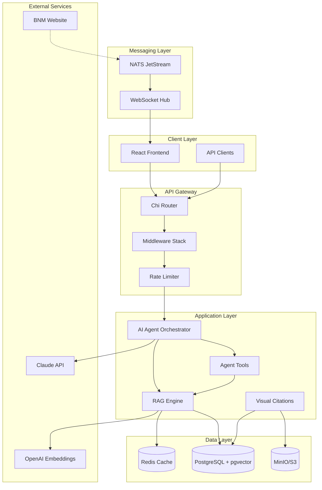
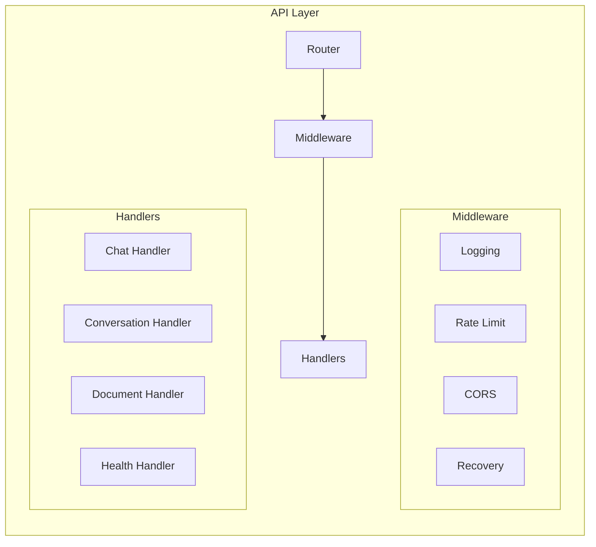
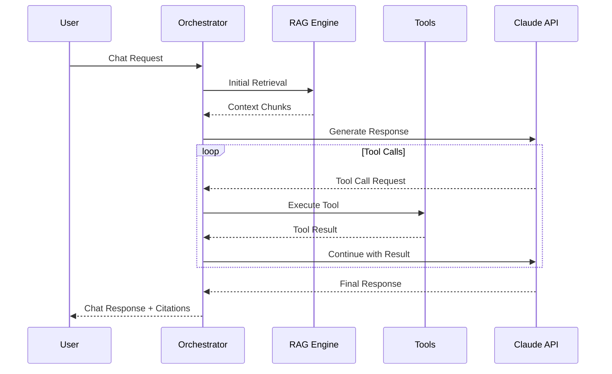
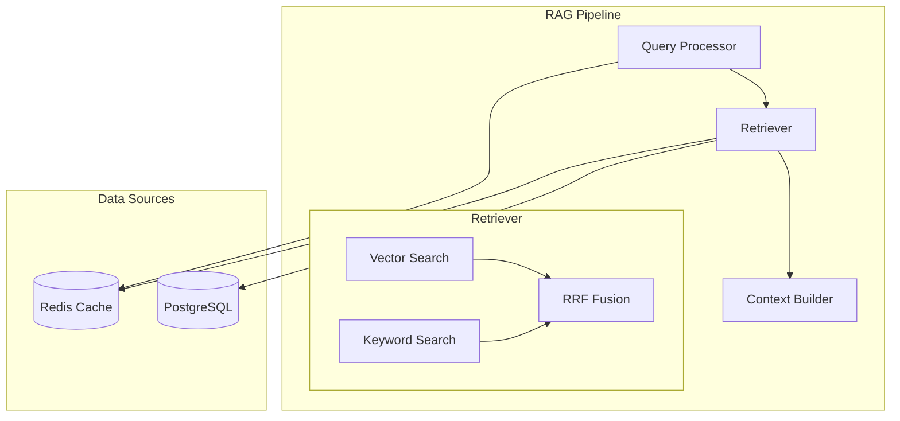
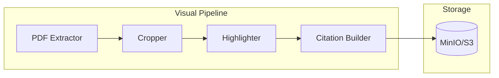
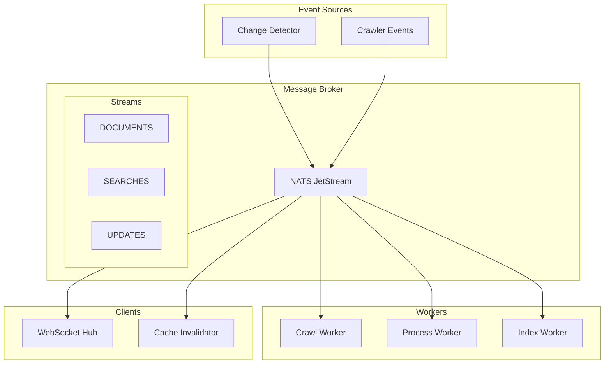
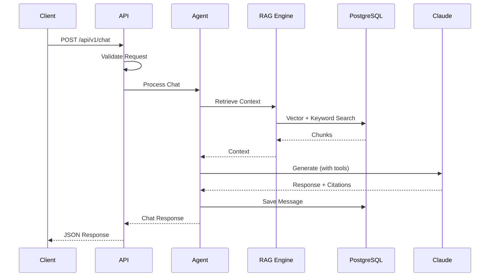
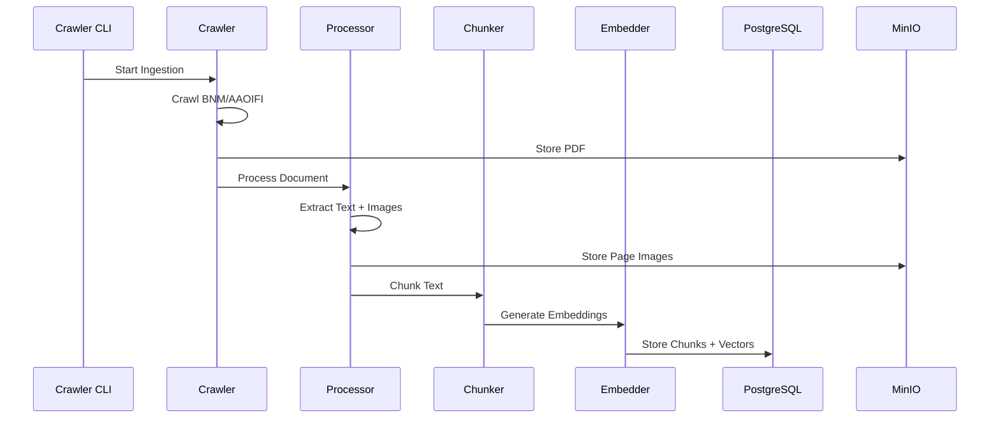
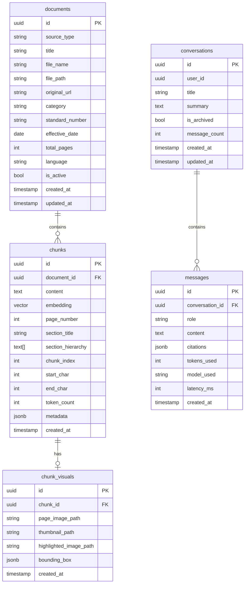
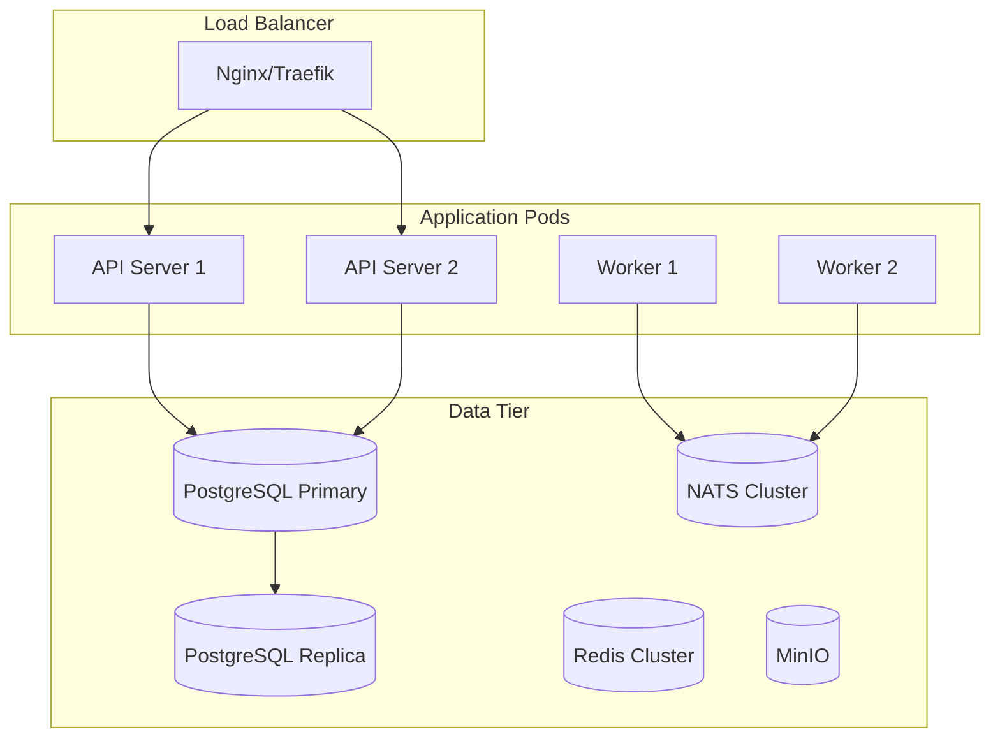

# System Architecture

## Overview

ShariaComply AI is a RAG (Retrieval-Augmented Generation) based compliance assistant for Islamic banking professionals. It provides AI-powered responses with visual citations from BNM regulations and AAOIFI Shariah Standards.

## High-Level Architecture

## Component Architecture

### 1. API Layer (`internal/api/`)

**Responsibilities:**
- HTTP request routing via Chi router
- Request validation and error handling
- Rate limiting (per-endpoint limits)
- Structured logging and metrics
- CORS and security headers

### 2. AI Agent (`internal/agent/`)

**Components:**
- **Orchestrator**: Manages Claude API interaction with tool calling loop
- **Memory**: PostgreSQL + Redis conversation history
- **Tools**: BNM search, AAOIFI search, comparison, latest circulars

### 3. RAG Engine (`internal/rag/`)

**Components:**
- **Query Processor**: Normalizes queries, extracts entities, suggests filters
- **Retriever**: Hybrid search with Reciprocal Rank Fusion
- **Context Builder**: Constructs LLM context with token budget management
- **Cache**: Redis caching for embeddings and retrieval results

### 4. Visual Citations (`internal/visual/`)

**Components:**
- **PDF Extractor**: Extracts single pages from PDFs using pdfcpu
- **Highlighter**: Draws bounding boxes on page images using gg
- **Cropper**: Crops images with context padding
- **Citation Builder**: Assembles visual citations with URLs

### 5. Real-Time Architecture (`internal/realtime/`)

**Components:**
- **NATS Client**: JetStream with 3 streams (DOCUMENTS, SEARCHES, UPDATES)
- **Change Detector**: Monitors BNM for content changes
- **Worker Pool**: Background processing with manual acknowledgment
- **WebSocket Hub**: Pushes updates to connected clients
- **Cache Invalidator**: Clears stale cache entries

## Data Flow

### Chat Request Flow

### Document Ingestion Flow

## Database Schema

## Technology Stack

| Layer | Technology | Purpose |
|-------|------------|---------|
| **Frontend** | React 18, TypeScript, Tailwind CSS | User interface |
| **API** | Go 1.22+, Chi router | HTTP server |
| **AI** | Claude API (Anthropic) | LLM responses |
| **Embeddings** | OpenAI text-embedding-3-small | Vector embeddings |
| **Database** | PostgreSQL 16 + pgvector | Data + vector storage |
| **Cache** | Redis 7 | Caching + sessions |
| **Messaging** | NATS JetStream | Event streaming |
| **Object Storage** | MinIO (S3-compatible) | Files + images |
| **PDF Processing** | go-fitz (MuPDF), pdfcpu | PDF extraction |
| **Image Processing** | fogleman/gg | Image manipulation |

## Deployment Architecture

## Security Considerations

1. **API Security**: Rate limiting, input validation, CORS
2. **Data Security**: Encrypted connections (TLS), parameterized queries
3. **Secrets Management**: Environment variables, never in code
4. **Access Control**: Signed URLs for document downloads

## Performance Optimizations

1. **Caching**: Redis for embeddings (1hr TTL), retrieval results (5min TTL)
2. **Connection Pooling**: PostgreSQL (25 open, 5 idle)
3. **Batch Processing**: Embedding generation in batches of 100
4. **Vector Index**: IVFFlat with 100 lists for fast similarity search
5. **Worker Pools**: Concurrent document processing
